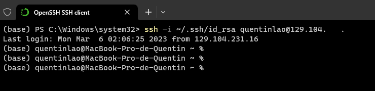
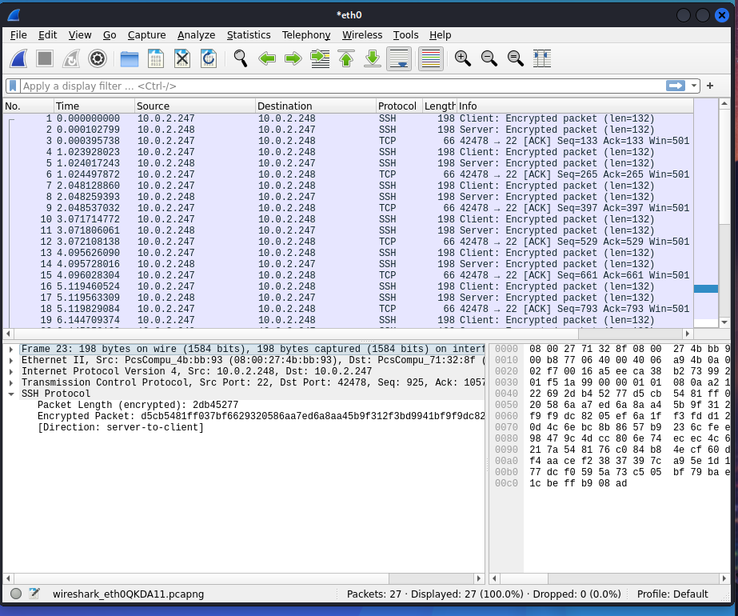

# VPNs

Def : Client (that controls) VS Server (that is controlled in remote)

## Basic SSH

### Password-based authentification

The basic command to access to a server from the client is :
```
ssh quentinlao@129.104.231.25
```
This method asks for the server's password : password-based authentification. 


### Key-based authentification

1. On the client, generate ssh public/private keys :
```
ssh-keygen -b 2048
```

2. Get the client's public key :
```
cat ~/.ssh/id_rsa.pub
```

3. Copy the content of the public key in the _~/.ssh/authorized_keys_ file

4. Access to the server without any password (_~/.ssh/id_rsa_ is the client's private key):
```
ssh -i ~/.ssh/id_rsa quentinlao@129.104.231.25
```




## Straight and reverse port forwarding with SSH

### Port forwarding with SSH

#### General command

```
ssh -N -L <LOCAL IP>:<LOCAL PORT>:<TARGET IP>:<TARGET PORT> user@X.X.X.X(through ssh)
```

For instance, `ssh -N -L localhost:8989:localhost:80 quentinlao@129.104.231.25` means __"I can have access to _localhost:80_ of quentinlao@129.104.231.25 via _localhost:8989_ of my local machine"__.

#### Test

To test port forwarding, I run a webserver on my Macbook at _localhost:80_ :
```
python -m http.server 80
```
Thus, every device on the same network should get the following page :


Then, I use a firewall to block all ports except port 22 (i.e SSH port) :
1. Write a new rule _/etc/pf_myrule.conf_:
```
# Set the interface to be used
if="en0"

# Default Deny Policy
block all

# Skip the loop back interface
set skip on lo

web_ports = "{22}"

# Pass in only web traffic
pass in quick on $if proto tcp to any port $web_ports keep state
pass out quick on $if proto tcp to any port $web_ports keep state
```

2. Enable the rule :
```
sudo pfctl -e -f /etc/pf_myrule.conf
```
(`sudo pfctl -d -f /etc/pf_myrule.conf` to deactivate the rule)


Now, every device trying to access my Macbook's website would not be able to load the page :


On any device, we will use a SSH tunnel to access my Macbook's website as the port 22 is still open :
`ssh -N -L localhost:8989:localhost:80 quentinlao@129.104.231.25`


So, on a device connected on the same network as my Macbook, I can access to my webserver at _localhost:80_ via _localhost:8989_ :


### Reverse port forwarding with SSH

```
ssh -N -R <TARGET IP>:<TARGET PORT>:<LOCAL IP>:<LOCAL PORT> user@X.X.X.X(through ssh)
```

For instance, `ssh -N -R localhost:8989:localhost:80 quentinlao@129.104.231.25` means __"I allow quentinlao@129.104.231.25 to access my _localhost:80_ via his _localhost:8989_"__.


### Practice case with 4 people

#### Context

We'll be reproducing the following situation :
```
          INTERNET NETWORK 1                                              INTERNET NETWORK 2
---------------------------------------                      ------------------------------------------
|     PC1       <--------->     PC2   |    <============>    |    VM1      <--------->        VM2     |
|             can communicate         |      SSH tunnel      |           can communicate    Webpage   |
---------------------------------------                      ------------------------------------------
```

* The server (VM2) hosts a website that can only be accessible from machines on the same network. Here is a screenshot from VM1 :

* PC1 wants to access to VM2's website
* VM1 and VM2 are both virtual machine behind a NAT


#### SSH Tunnel


VM2 is in a NAT Network. _10.0.2.15_ is actually a private IP address whereas _129.104.231.25_ is a public one. Let's use __reverse port forwarding__ instead. First of all, set `GatewayPorts yes` in the file __/etc/ssh/sshd_config__ on PC2. Then run the following command on VM1 :
```
ssh -N -R localhost:8080:10.0.2.253:80 quentinlao@129.104.231.25
```
saying _"I allow quentinlao@129.104.231.25 to access _10.0.2.253:80_ via his _localhost:8080"._


Finally, establish a straight port forward connection between PC1 et and PC2 so that PC1 can access to PC2's localhost:8080. On PC1, run :
```
ssh -N -L 8888:localhost:8080 quentinlao@129.104.231.25
```
which means _"I want to access to quentinlao@129.104.231.25's localhost:8080 via my localhost:8888"_


Here we are on PC1 :


## TUN/TAP Interfaces

I am using 2 Linux VMs. 


### Basic VPN

We will use `tunctl` that can be downloaded with the command `sudo apt-get install uml-utilities`


1. On the server, create and configure a tap interface :
```
sudo tunctl -t tap0 -u server_name
sudo ifconfig tap0 192.16.42.21/24 up
```

2. On the client, create and configure a tap interface :
```
sudo tunctl -t tap0 -u server_name
sudo ifconfig tap0 192.16.42.20/24 up
```

NB : _192.16.42.21/24_ and _192.16.42.20/24_ can be arbitrary chosen

3. On the server, uncomment and set the field `PermitTunnel yes`

4. Restart the SSH server
```
sudo systemctl restart ssh.service
```

5. Run the SSH tunnel using the interface _tap0_ on obth server and client :
```
sudo -N -o Tunnel=ethernet -w 0:0 kali_server@10.0.2.248
```


Now, if the client can succesfully ping the server. This is what the server sees on Wireshark on the interface tap0 :


This is what it sees on the interface eth0 :



As expected, we observe encrypted traffic on the eth0 interface and decrypted traffic on the tap0 interface. This indicates that the SSH tunnel is working correctly and that traffic is being securely transmitted between the two endpoints.


### Tunnelling program

#### Context

Let's right a tunnelling program in Python. The tap interface is used to capture network traffic sent and received by other applications on the same system. Our program must be able to read packets from the tap interface (i.e reading the file _/dev/net/tun_), decapsulate and encapsulate them in a custom format before sending them to their destination. 

#### The program

My Python program is able to encapulate IP over UDP, TCP and ping. Each format corresponds to one class with an `encapsulate` method and a `decapsulate` method. 

To encrypt the traffic, notice that a private key and certificate must be generated. We'll be using a self-signed certificate here :
```
openssl req -new -sha256 -newkey rsa:2048 -nodes -keyout server.key -x509 -days 3650 -out server.crt
```

This is how an IP packet in encapsulated in an UDP packet. Our program adds the IP and the UDP header.

```
###[ IP ]### 
  version   = 4
  ihl       = None
  tos       = 0x0
  len       = None
  id        = 1
  flags     = 
  frag      = 0
  ttl       = 64
  proto     = udp
  chksum    = None
  src       = 192.168.1.1
  dst       = 192.168.1.2
  \options   \
###[ UDP ]### 
     sport     = 1234
     dport     = 5678
     len       = None
     chksum    = None
###[ Ethernet ]### 
        dst       = 33:33:00:00:00:16
        src       = fe:6e:62:bc:03:e2
        type      = IPv6
###[ IPv6 ]### 
           version   = 6
           tc        = 0
           fl        = 0
           plen      = 36
           nh        = Hop-by-Hop Option Header
           hlim      = 1
           src       = fe80::fc6e:62ff:febc:3e2
           dst       = ff02::16
###[ IPv6 Extension Header - Hop-by-Hop Options Header ]### 
              nh        = ICMPv6
              len       = 0
              autopad   = On
              \options   \
               |###[ Router Alert ]### 
               |  otype     = Router Alert [00: skip, 0: Don't change en-route]
               |  optlen    = 2
               |  value     = Datagram contains a MLD message
               |###[ PadN ]### 
               |  otype     = PadN [00: skip, 0: Don't change en-route]
               |  optlen    = 0
               |  optdata   = ''
###[ MLDv2 - Multicast Listener Report ]### 
                 type      = MLD Report Version 2
                 res       = 0
                 cksum     = 0xa5e
                 reserved  = 0
                 records_number= 1
                 \records   \
                  |###[ ICMPv6 MLDv2 - Multicast Address Record ]### 
                  |  rtype     = 4
                  |  auxdata_len= 0
                  |  sources_number= 0
                  |  dst       = ff02::1:ffbc:3e2
                  |  sources   = [  ]
                  |  auxdata   = ''
```