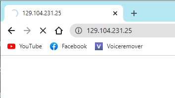
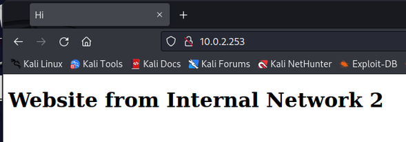
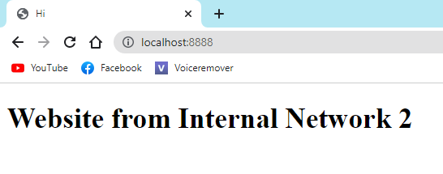

# VPNs

Def : Client (that controls) VS Server (that is controlled in remote)

## Basic SSH

### Password-based authentification

The basic command to access to a server from the client is :
```
ssh quentinlao@129.104.231.25
```
This method asks for the server's password : password-based authentification. 


### Key-based authentification

1. On the client, generate ssh public/private keys :
```
ssh-keygen -b 2048
```

2. Get the client's public key :
```
cat ~/.ssh/id_rsa.pub
```

3. Copy the content of the public key in the _~/.ssh/authorized_keys_ file

4. Access to the server without any password (_~/.ssh/id_rsa_ is the client's private key):
```
ssh -i ~/.ssh/id_rsa quentinlao@129.104.231.25
```


## Straight and reverse port forwarding with SSH

### Port forwarding with SSH

#### General command

```
ssh -N -L <LOCAL IP>:<LOCAL PORT>:<TARGET IP>:<TARGET PORT> user@X.X.X.X(through ssh)
```

For instance, `ssh -N -L localhost:8989:localhost:80 quentinlao@129.104.231.25` means __"I can have access to _localhost:80_ of quentinlao@129.104.231.25 via _localhost:8989_ of my local machine"__.

#### Test

To test port forwarding, I run a webserver on my Macbook at _localhost:80_ :
```
python -m http.server 80
```
Thus, every device on the same network should get the following page :


Then, I use a firewall to block all ports except port 22 (i.e SSH port) :
1. Write a new rule _/etc/pf_myrule.conf_:
```
# Set the interface to be used
if="en0"

# Default Deny Policy
block all

# Skip the loop back interface
set skip on lo

web_ports = "{22}"

# Pass in only web traffic
pass in quick on $if proto tcp to any port $web_ports keep state
pass out quick on $if proto tcp to any port $web_ports keep state
```

2. Enable the rule :
```
sudo pfctl -e -f /etc/pf_myrule.conf
```
(`sudo pfctl -d -f /etc/pf_myrule.conf` to deactivate the rule)


Now, every device trying to access my Macbook's website would not be able to load the page :



On any device, we will use a SSH tunnel to access my Macbook's website as the port 22 is still open :
`ssh -N -L localhost:8989:localhost:80 quentinlao@129.104.231.25`


So, on a device connected on the same network as my Macbook, I can access to my webserver at _localhost:80_ via _localhost:8989_ :


### Reverse port forwarding with SSH

```
ssh -N -R <TARGET IP>:<TARGET PORT>:<LOCAL IP>:<LOCAL PORT> user@X.X.X.X(through ssh)
```

For instance, `ssh -N -R localhost:8989:localhost:80 quentinlao@129.104.231.25` means __"I allow quentinlao@129.104.231.25 to access my _localhost:80_ via his _localhost:8989_"__.


### Practice case with 4 people

#### Context

We'll be reproducing the following situation :
```
          INTERNET NETWORK 1                                              INTERNET NETWORK 2
---------------------------------------                      ------------------------------------------
|     PC1       <--------->     PC2   |    <============>    |    VM1      <--------->        VM2     |
|             can communicate         |      SSH tunnel      |           can communicate    Webpage   |
---------------------------------------                      ------------------------------------------
```

* The server (VM2) hosts a website that can only be accessible from machines on the same network. Here is a screenshot from VM1 :

* PC1 wants to access to VM2's website
* VM1 and VM2 are both virtual machine behind a NAT


#### SSH Tunnel


VM2 is in a NAT Network. _10.0.2.15_ is actually a private IP address whereas _129.104.231.25_ is a public one. Let's use __reverse port forwarding__ instead. First of all, set `GatewayPorts yes` in the file __/etc/ssh/sshd_config__ on PC2. Then run the following command on VM1 :
```
ssh -N -R localhost:8080:10.0.2.253:80 quentinlao@129.104.231.25
```
saying _"I allow quentinlao@129.104.231.25 to access _10.0.2.253:80_ via his _localhost:8080"._


Finally, establish a straight port forward connection between PC1 et and PC2 so that PC1 can access to PC2's localhost:8080. On PC1, run :
```
ssh -N -L 8888:localhost:8080 quentinlao@129.104.231.25
```
which means _"I want to access to quentinlao@129.104.231.25's localhost:8080 via my localhost:8888"_


Here we are on PC1 :




