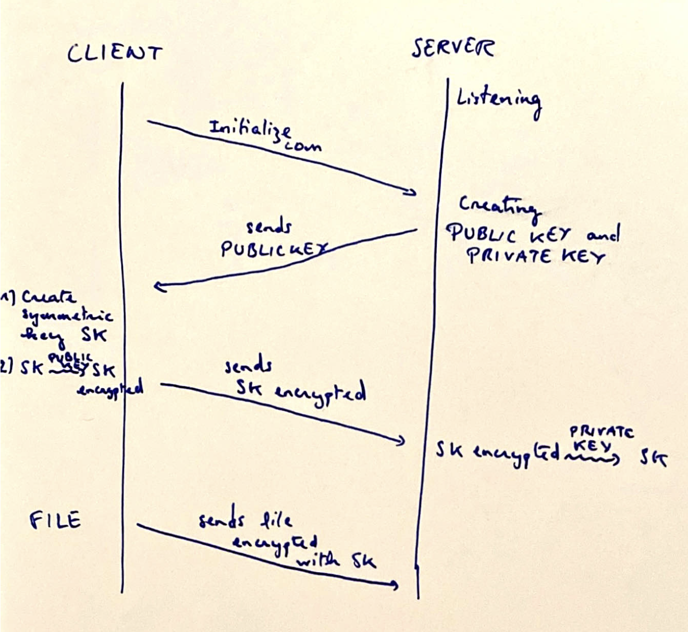
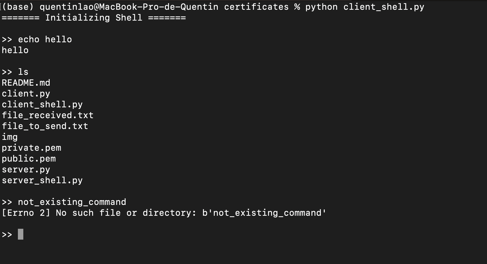
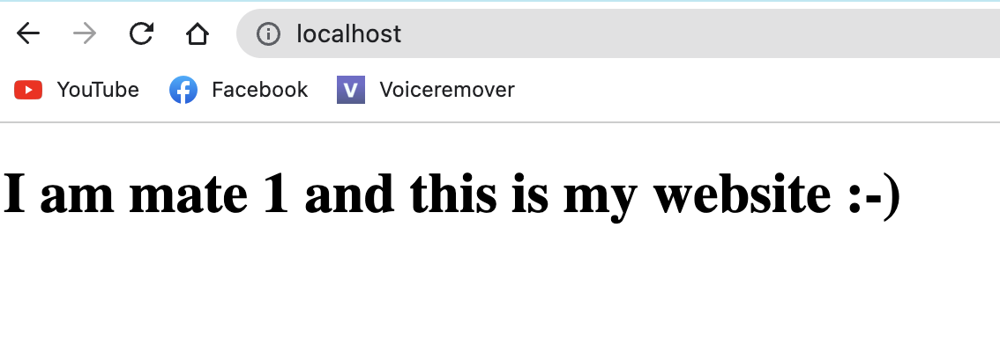
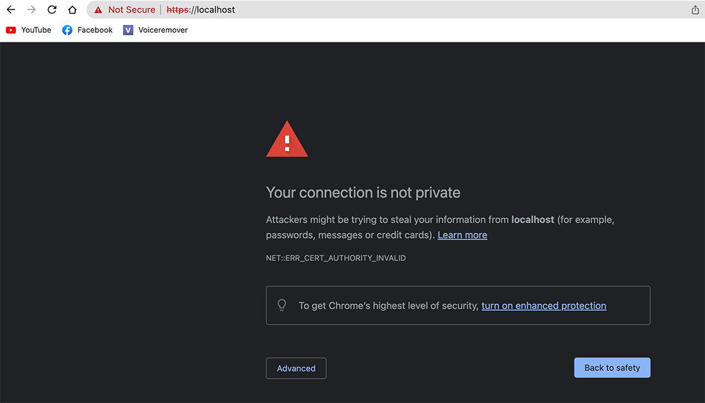
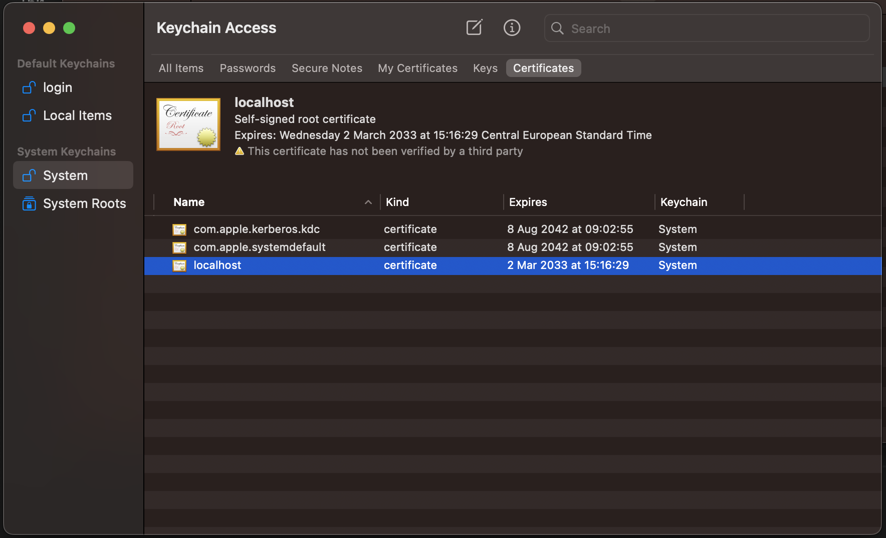
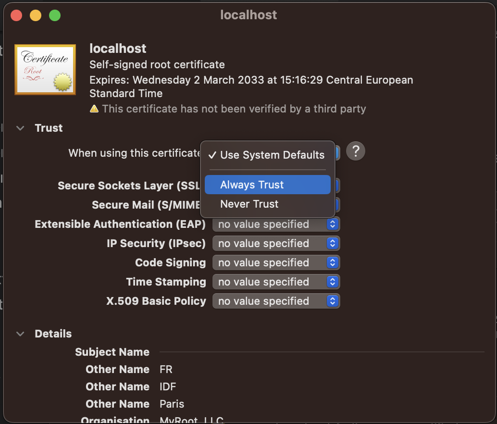
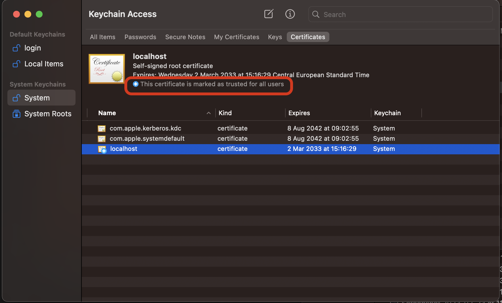
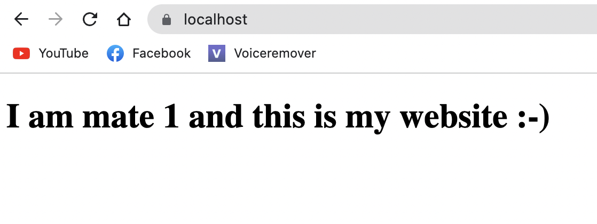

# Certificates

## Basic encryption with OpenSSL

### OpenSSL commands

We use OpenSSL tool to encryption. The following command in the shell generate private.pem that contains a private key :
```
$ openssl genrsa -out private.pem 2048
```
Extract the public key :
```
$ openssl rsa -in private.pem -pubout -out public.pem
```

### Illustration of the exercise

The exercise can be drawn as follow :


### The server.py and client.py files

The exercise involves 6 files :
* `server.py` : the server program
* `client.py` : the client program
* `private.pem` : the private key generated by the server using the OpenSSL command above
* `public.pem` : the public key generated by the server using the OpenSSL command above
* `file_to_send.txt` : file example that the client wants to send to the server
* `file_received.txt` : file written by the server, decrypting the data sent by the client

NB : `file_to_send.txt` and `file_received.txt` must be identical, otherwise the exercice is not correct and there is an error somewhere.


### To go further : secure shell

To go further, instead of sending files, we can send shell commands in remote to the server, execute the commands on the server and send back to the client what is printed. All the communication will be encrypted by the symmetric key generated by the client. It is quiet secure as the client transfered this symmetric key to server by signing it with the server's public key. So, in theory, the client and the server are the only one that know the symmetric key.

This exercice involves 2 files : 
* `server_shell.py` : the server program
* `client_shell.py` : the client program


In a terminal tab, run the server on which the shell commands will be executed : `python server_shell.py`. On another tab, run the  client that will send the shell commands to the server in remote : `python client_shell.py`. On the client tab, we have a shell interface like a real shell but the commands are executed on the server ! The shell returns error as well.




## Basic certification authority

### Files

```
.
├── certification_authority.py
│   ├── CA_private.pem : Certification authority's private key
│   ├── CA_public.pem : Certification authority's public key
│   ├── certificate_data_base : Database with servers that the CA authenticates (.bin files)
├── server_with_certification.py
│   ├── private.pem : Server's private key
│   ├── public.pem : Server's public key
│   ├── <SERVERNAME>.json : Server's certificate
├── client_with_certification.py
│   ├── <SERVERNAME>_to_check.json : Certificate received by the client (should be the same as mycertificate.json)
├── file_to_send.txt : file example that the client wants to send to the server
├── file_received.txt : file decrypting the data sent by the client (should the same as file_to_send.txt)
```

### Run commands

1. Generates public/private keys for the server and its certificate
```
python server_with_certificate.py -gen_keys
```

2. Generates public and private keys of the certification authority
```
python certification_authority.py -gen_keys
```

3. Authenticates a server by signing its certificate (here, `<SERVER'S NAME> = "server_very_sercure"`)
```
python certification_authority.py -gen_certif <SERVER'S NAME>
```

4. Run the server
```
python server_with_certificate.py -run
```

5. Run the client
```
python client_with_certificate.py
```

### Roles

#### Certification authority

Its goal is to authenticate servers by signing their hashed certificate. A certificate is simply a json file with the name of the server and its public key.

#### Server

Instead of sending its public key, the server sends its certificate to the client

#### Client

The client receives the certificate of the server and searches in the certification authority's database if the server exists (e.g search for the signed hashed-certificate). Then, the client verified the certificate it receives with this signature.


## X.509 certificates with OpenSSL

### Localhost webserver setup

I use XAMPP. On MacOS, XAMPP files are strored in the directory Applications > XAMPP > xamppfiles. To setup a Apache web server on the localhost :

1. In the `htdocs` directory, replace the default `index.php` file with our own `index.html`
2. Back to `xamppfiles` directory, run the Apache server on localhost with the command :
```
sudo ./xampp start
```

Here is what we've got :


This is an http website. When trying to force security by attemping to access `https://localhost` :


Our goal is to be able to run an HTTPS web server.


3. Stop the server with :
```
sudo ./xampp stop
```


### Generate the certificates

We have to generate :
* the selfsigned certificate of the trusted CA
* the certificate of our localhost website (mate 1) and a mate's website connected on the same network (mate 2)

#### OpenSSL Commands

First, we generate the certificates for the __Trusted root CA__ :
```
openssl req -new -sha256 -newkey rsa:2048 -nodes -keyout private_myroot.key -x509 -days 3650 -out cert_myroot.crt
```

Then, we generate the CSR for __both mates__ (1 and 2) signed by the trusted root CA:
```
openssl genrsa -out private_mate_i.key 2048
openssl req -new -key private_mate_i.key -out cert_mate_{}.csr
```

Ask for the __Trusted root CA__ to signs :
```
openssl x509 -req -days 365 -in cert_mate_i.csr -CA cert_myroot.crt -CAkey private_myroot.key -set_serial 01 -out cert_mate_i.crt
```

#### Commands in practice

To make the things easier, all the commands can be run with the unique commands :
```
python make.py
```

To clear all the certificates generated :
```
python make.py clean
```

### Incorpore the certificates

These section must be done by every part/mate

#### Root CA, trusted by our browser

Our browser must trust our selfsigned certificate for our root CA. I am using Google Chrome. Google Chrome trusts the certificates that our Macbook actually does. To add our root CA's certificate in the list of trusted CA :

1. Double click on the file `cert_myroot.crt`. It should open the Keychain Access application and adds our certificate :


2. Our certificate is called "localhost" here. Double click on it. It should open a window. Select "Always trust" and close the window ;


Now, the root CA's certificate is trusted as written in blue :



#### Certify our Apache server

We have to provide our certificate and private key to the apache server. Go to the directory Applications > XAMPP > xamppfiles > etc. 

Open the `ssl.crt` directory and replace the current `server.crt` with our own certificate (`cert_mate_1.crt`). Don't forget to rename to `server.crt`.

Then, open the `ssl.key` directory and replace the current `server.key` with our private key (`private_mate_1.key`). Don't forget to rename to `server.key`.

Run the following command to restart the Apache webserver :
```
sudo ./xampp restart
```

Now, enjoy the lock at https://localhost !


