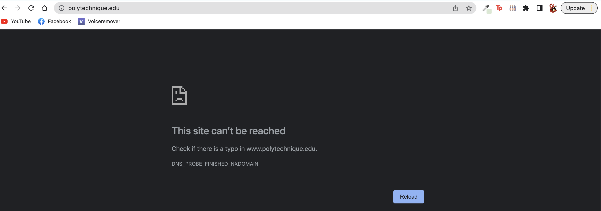

# A Forcefully Validating Recursive Resolver

## Background

The Domain Name System Security Extensions (DNSSEC) is a set of protocols that provides security for the DNS. DNSSEC adds digital signatures to DNS records, which allows DNS resolvers to verify the authenticity of DNS data. By validating DNS responses using DNSSEC, it's possible to protect against various attacks, including DNS cache poisoning, man-in-the-middle attacks, and DNS spoofing.

## Run a BIND9 DNS on localhost

Fill the `named.conf` file that configures our DNS resolver :

```
    # /etc/named.conf
    acl authorisedclients {
        192.168.147.0/24;
        localhost;
        localnets;
    };
        options {
            directory "/var/cache/bind";                    # This is the file, where cached names will be stored
            recursion yes;                                  # Do we allow the server to do recursion? (remember, the ra flag?)
            allow-query { authorisedclients; } ;            # A list of ACLs that specify who is allowed to query the server.
        dnssec-enable yes;
        dnssec-validation auto;                         #
        auth-nxdomain no;                               # This is included for RFC1035 conformity
            listen-on-v6 { any; };                          #
        };

    # prime the server with knowledge of the root servers
    zone "." {
        type hint;
    };
```

Check that the configuration is correct and run the server :
```
/usr/local/sbin/named-checkconf /etc/named.conf
sudo /usr/local/sbin/named -c /etc/named.conf -d 3 -g
```


## Force DNSSEC validation


### On the domain polytechnique.fr

When digging www.polytechnique.fr with the command `dig @127.0.0.1 www.polytechnique.fr +dnssec` :
```
; <<>> DiG 9.16.38 <<>> @127.0.0.1 www.polytechnique.fr +dnssec
; (1 server found)
;; global options: +cmd
;; Got answer:
;; ->>HEADER<<- opcode: QUERY, status: NOERROR, id: 60460
;; flags: qr rd ra; QUERY: 1, ANSWER: 2, AUTHORITY: 0, ADDITIONAL: 1

;; OPT PSEUDOSECTION:
; EDNS: version: 0, flags: do; udp: 1232
; COOKIE: 8eebdd88550501210100000063fb40aa9b28743b25ea3676 (good)
;; QUESTION SECTION:
;www.polytechnique.fr.		IN	A

;; ANSWER SECTION:
www.polytechnique.fr.	3600	IN	CNAME	drupal.polytechnique.fr.
drupal.polytechnique.fr. 86400	IN	A	129.104.30.29

;; Query time: 1267 msec
;; SERVER: 127.0.0.1#53(127.0.0.1)
;; WHEN: Sun Feb 26 15:21:14 +04 2023
;; MSG SIZE  rcvd: 114
```
As we can see, the flags `ad` is not set which indicates that RRsets are not authenticated. To do so, we have to have an option in the DNS's configuration `dnssec-must-be-secure polytechnique.fr. yes ;`. That means that we are instructing BIND to enforce DNSSEC validation for the "polytechnique.fr" domain e.g BIND will not return any answers for queries related to this domain unless it can successfully validate the DNSSEC signature chain. Let's dig again, and here is the response :
```
; <<>> DiG 9.16.38 <<>> @127.0.0.1 www.polytechnique.fr +dnssec
; (1 server found)
;; global options: +cmd
;; Got answer:
;; ->>HEADER<<- opcode: QUERY, status: SERVFAIL, id: 52412
;; flags: qr rd ra; QUERY: 1, ANSWER: 0, AUTHORITY: 0, ADDITIONAL: 1

;; OPT PSEUDOSECTION:
; EDNS: version: 0, flags: do; udp: 1232
; COOKIE: 7c931e0099b962740100000063fb74551f4d42d11fab83b4 (good)
;; QUESTION SECTION:
;www.polytechnique.fr.		IN	A

;; Query time: 2180 msec
;; SERVER: 127.0.0.1#53(127.0.0.1)
;; WHEN: Sun Feb 26 19:01:41 +04 2023
;; MSG SIZE  rcvd: 77
```
The DNS response shows a status of "SERVFAIL", indicating that the server encountered an error while attempting to validate the DNSSEC signature chain. This could be due to a few different reasons, such as:
* __Misconfiguration of our DNS__ : The DNS must be correclty configurated. For instance, we should make sure `dnssec-enable` is set to _yes_ and `dnssec-validation` is set to _auto_. From a quick look, the configuration is correct.  
* __The zone may not be signed__: DNSSEC requires that each zone in the DNS hierarchy be signed with a public/private key pair, and the corresponding public key must be made available in a DNS record. If the polytechnique.fr zone is not signed, or if the zone's keys are not properly configured, DNSSEC validation will fail.

### Is polytechnique.fr a non-signed zone ?

Let's look for any DNSKEY record with the command `dig @127.0.0.1 +dnssec +multiline www.polytechnique.fr DNSKEY`. Here is the response :
```
; <<>> DiG 9.16.38 <<>> @127.0.0.1 +dnssec +multiline www.polytechnique.fr DNSKEY
; (1 server found)
;; global options: +cmd
;; Got answer:
;; ->>HEADER<<- opcode: QUERY, status: NOERROR, id: 52869
;; flags: qr rd ra; QUERY: 1, ANSWER: 1, AUTHORITY: 1, ADDITIONAL: 1

;; OPT PSEUDOSECTION:
; EDNS: version: 0, flags: do; udp: 1232
; COOKIE: 1063b9c162d650590100000063fb753236e49cfdef60233b (good)
;; QUESTION SECTION:
;www.polytechnique.fr.	IN DNSKEY

;; ANSWER SECTION:
www.polytechnique.fr.	3600 IN	CNAME drupal.polytechnique.fr.

;; AUTHORITY SECTION:
polytechnique.fr.	3600 IN	SOA milou.polytechnique.fr. hostmaster.polytechnique.fr. (
				2023022314 ; serial
				7200       ; refresh (2 hours)
				3600       ; retry (1 hour)
				1209600    ; expire (2 weeks)
				3600       ; minimum (1 hour)
				)

;; Query time: 1719 msec
;; SERVER: 127.0.0.1#53(127.0.0.1)
;; WHEN: Sun Feb 26 19:05:22 +04 2023
;; MSG SIZE  rcvd: 151
```

This command returns only a CNAME record for www.polytechnique.fr and an SOA record for the domain polytechnique.fr, but no DNSKEY record, which is necessary for DNSSEC validation. 

To confirm my intuition, I run `dig @127.0.0.1 www.polytechnique.fr +dnssec +trace`. `+trace` instructs dig to perform a trace route of the DNS resolution process, allowing us to see the DNS servers that are responsible for handling the query at each stage. Here is the response :
```
; <<>> DiG 9.16.38 <<>> @127.0.0.1 www.polytechnique.fr +dnssec +trace
; (1 server found)
;; global options: +cmd
.			518299	IN	NS	[a-m].root-servers.net.
.			518299	IN	RRSIG	NS 8 0 518400 20230311050000 20230226040000 951 . OlZmlqEA/yh3ZZ8Bfd8wi7GkoufrBBepzvRpmeHH7VZUz0faetJZdlsC YnHIrjXEyHhjqFyU6+sZG/yTFj0oBrjjUa6OEraTYqHxae1zNEYi4j15 pehA/bvvJyuLefYlddmNModtimjXPxnCS2c/tFSKqIzFbd9rga7morgx sYIigcmfX6R6PcncbIJWVk/EDajDSipOylxaycpDOfVzHei7hLTgHeFG PkNDE9ieyBZB7zBGkzIEnOeWDRdEkhYZvLFg71lzIsHHIDtYNVympbha 1II4CA94yy9T/yfXkO7Ce/mNXY2AdvzHs7t3fjrMPRCE6KW9KTOYY4EV AEPzDQ==
;; Received 1137 bytes from 127.0.0.1#53(127.0.0.1) in 0 ms

fr.			172800	IN	NS	e.ext.nic.fr.
fr.			172800	IN	NS	f.ext.nic.fr.
fr.			172800	IN	NS	g.ext.nic.fr.
fr.			172800	IN	NS	d.nic.fr.
fr.			86400	IN	DS	51508 13 2 1B3386864D30CCC8F4541B985BF2CA320E4F52C57C53353F6D29C9AD 58A5671F
fr.			86400	IN	RRSIG	DS 8 1 86400 20230311050000 20230226040000 951 . nl6iZHvFVUZoYcWOskzrELs8OFN2fHIiQ+OJB2IRsvsRxARLvvb+hAc/ 6Hxy7c/CMtmrUbbD3eNeS20v8ptDRmJYlX/xNtBuZN4L8QUfIRthKp6Y 36UFV0723wBEi5yNkZduRjK7+EECr+R/mdiRJrKirxUqQatyqtrSqwoN /3Dj3cm2tOQqAlmQX7SA0sK4OrmPGuops5BwSPYgV6WoUdsDRW9HrLms PcgE4rKK+ui4E95sGdCiYKln0SFlQnEUbARhp+IMrIG00m//VzfHff6b NrKU8TCOWIaqYHXdnyYuLM7ZPPmrhPAwwGwrUiZsWcjAQr8qZM2HIR/b /0nVMg==
;; Received 632 bytes from 198.41.0.4#53(a.root-servers.net) in 122 ms

polytechnique.fr.	172800	IN	NS	rackham.polytechnique.fr.
polytechnique.fr.	172800	IN	NS	milou.polytechnique.fr.
polytechnique.fr.	172800	IN	NS	ns2.nic.fr.
polytechnique.fr.	172800	IN	NS	picaros.polytechnique.fr.
SFBLG7NFATQ81CQJGT5Q91BQS3H9V6ND.fr. 5400 IN NSEC3 1 1 0 - SFBN9RJNNUEVSB0GNER878N1GN41D23I NS SOA TXT NAPTR RRSIG DNSKEY NSEC3PARAM TYPE65534
SFBLG7NFATQ81CQJGT5Q91BQS3H9V6ND.fr. 5400 IN RRSIG NSEC3 13 2 5400 20230329091334 20230223135138 10935 fr. s9egTk+WzOBErIIbS5HdnhUh3mKGQ8V9ioDWGlXwkuF0VQ8C471sMj91 R+/lO89LiJLP34S8binxYg+IVTWT8A==
4EB7HAFNS7PFOHBE4HR0L2L1LL6Q8D7M.fr. 5400 IN NSEC3 1 1 0 - 4EBANG4GF9R5QSDTUPE0NUEVO83PKUCC NS DS RRSIG
4EB7HAFNS7PFOHBE4HR0L2L1LL6Q8D7M.fr. 5400 IN RRSIG NSEC3 13 2 5400 20230415161302 20230214160908 10935 fr. 61pFEqAi3POGXS1hZo9TwuhYCp+d2FyK+kaKldYCzBqd9I8mV+beH49Y O3lUAZdgt9fU5R2kvuIIrCxIFO+9Gg==
;; Received 648 bytes from 2001:678:4c::1#53(g.ext.nic.fr) in 12 ms

www.polytechnique.fr.	3600	IN	CNAME	drupal.polytechnique.fr.
drupal.polytechnique.fr. 86400	IN	A	129.104.30.29
polytechnique.fr.	86400	IN	NS	rackham.polytechnique.fr.
polytechnique.fr.	86400	IN	NS	milou.polytechnique.fr.
polytechnique.fr.	86400	IN	NS	ns2.nic.fr.
polytechnique.fr.	86400	IN	NS	picaros.polytechnique.fr.
;; Received 334 bytes from 2001:660:3026::32:32:41#53(rackham.polytechnique.fr) in 114 ms
```

This command shows that the root zone and the .fr zone both support DNSSEC, but there is no indication that DNSSEC is supported for the polytechnique.fr domain. In addition, looking in the BIND-log during the call of `dig` :
```
27-Feb-2023 00:59:16.483 validating www.polytechnique.fr/CNAME: starting
27-Feb-2023 00:59:16.483 validating www.polytechnique.fr/CNAME: attempting insecurity proof
27-Feb-2023 00:59:16.483 validating www.polytechnique.fr/CNAME: checking existence of DS at 'fr'
27-Feb-2023 00:59:16.483 validating www.polytechnique.fr/CNAME: checking existence of DS at 'polytechnique.fr'
27-Feb-2023 00:59:16.483 validating www.polytechnique.fr/CNAME: must be secure failure, this is a delegation
```

Therefore, it seems that our initial assumption that the website does not support DNSSEC is correct.

The same method shows that the domain _google.fr_ is not DNSSEC signed as well.

### What should we expect on a signed zone ?

On a DNSSEC-activated domain like _apnic.net_, the default RR returned is authentic by default. There is no need to force DNSSEC. When running `dig @127.0.0.1 apnic.net +dnssec`, the response has the flag `ad` activated and returns a RRSIG with the _apnic.net_ RRSET:
```
...
;; flags: qr rd ra ad; QUERY: 1, ANSWER: 2, AUTHORITY: 0, ADDITIONAL: 1
...
;; ANSWER SECTION:
apnic.net.		3593	IN	A	203.119.101.61
apnic.net.		3593	IN	RRSIG	A 13 2 3600 20230311053514 20230224040514 31255 apnic.net. n+5IKDXT457fAEKlA+dahvspwlMdq/Halyv4bqiIpWJObQIXDy7GPfc7 HWJEG2um5iUg4TJqhVLb01cvJ05yZw==
...
```

## Conclusion

Bind is a powerful tool to host our own DNS server. We can configure it so that it prevents anyone using our DNS server from accessing a specific perimeter of domains (e.g a list of domains) that are not DNSSEC signed. For instance, a computer using our recursive resolver, configured as above, will not be able to reach _www.polytechnique.fr_ as the domain _polytechnique.fr_ is not DNSSEC signed :



However, this method cannot force DNSSEC on every domain. A computer using our DNS would still be able to reach _www.google.fr_ if _google.fr_ is not mentioned in the list of domains. Therefore, this method doesn't prevent accessing non-DNSSEC domains, but only make sure that the domains in a specific list returns authentic responses.